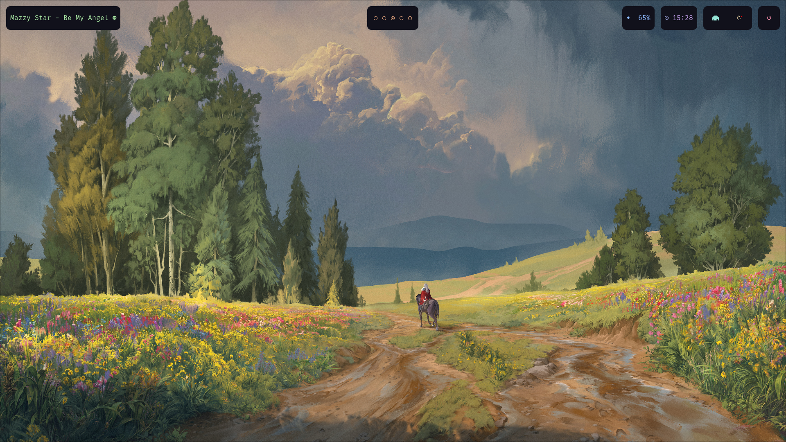
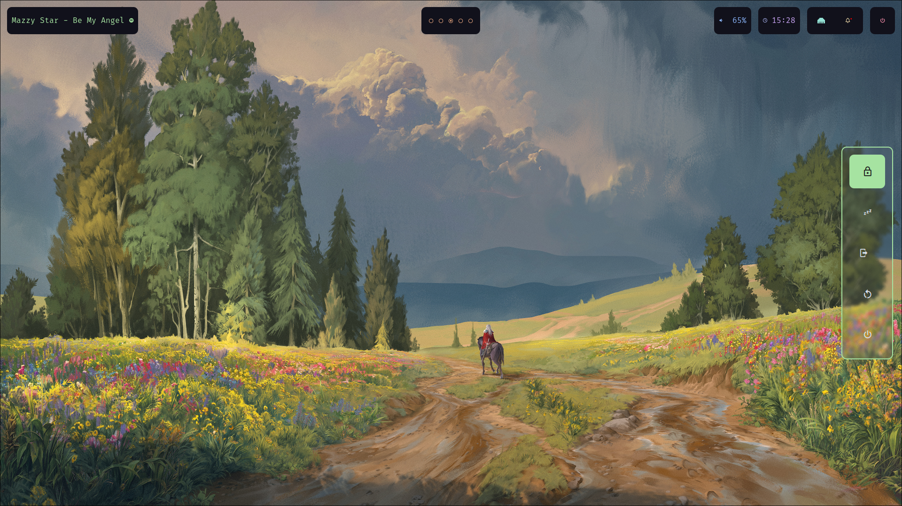
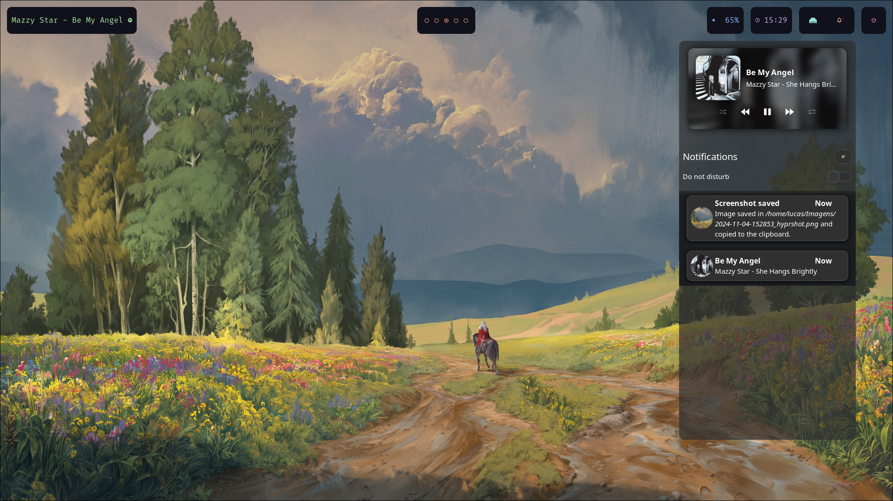
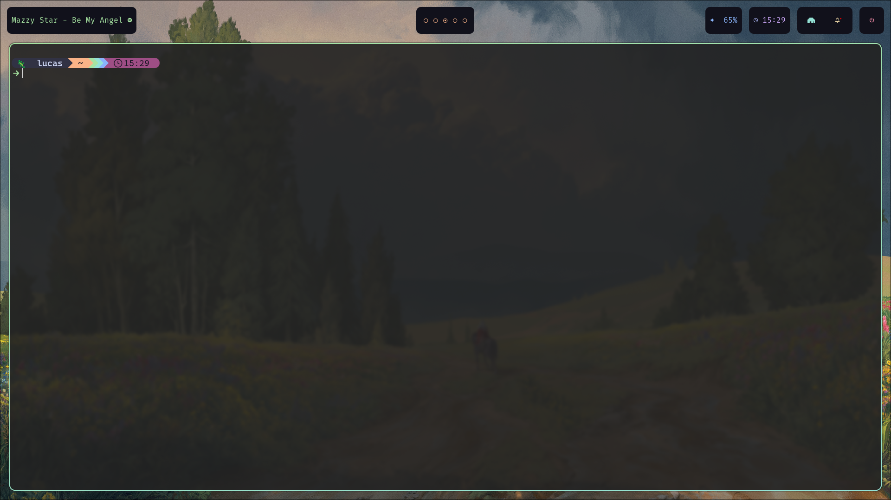
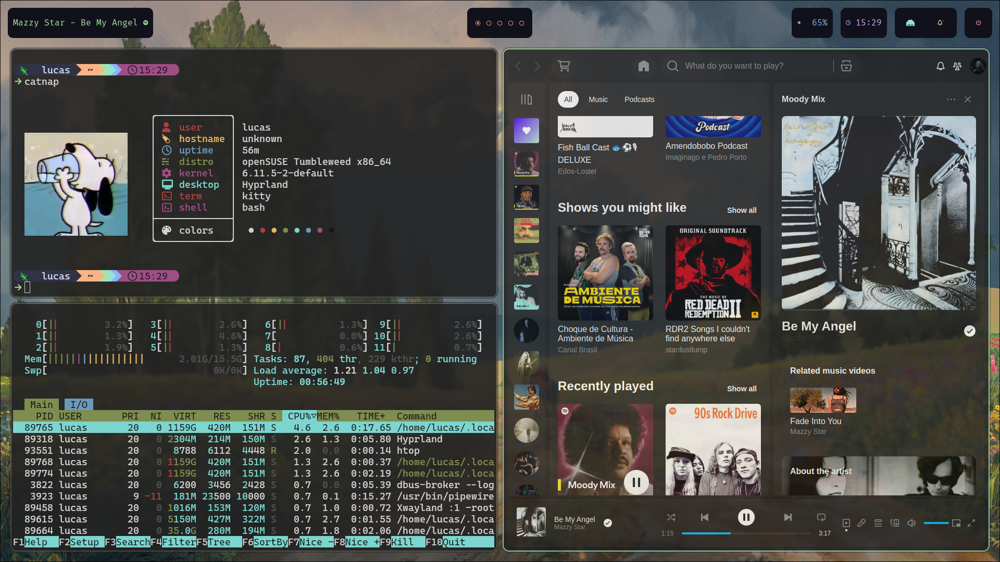
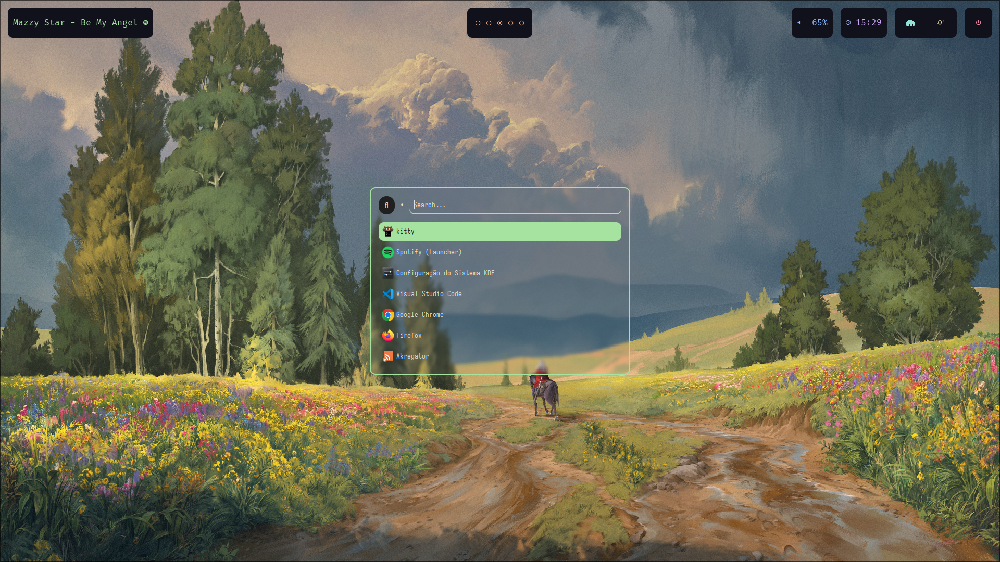
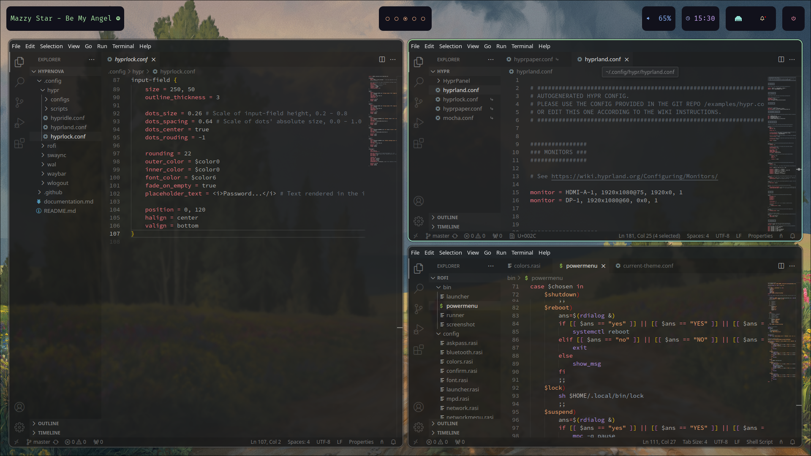

# 🎨 Dotfiles do Hyprland

Bem-vindo ao meu repositório de Dotfiles! Aqui você encontrará tudo o que precisa para personalizar sua experiência no Hyprland. 🌟

## 📁 Estrutura do Repositório


├── 📂 hypr

├── 📂 catnap

├── 📂 Backgrounds

├── 📂 rofi

├── 📂 swaync

├── 📂 waybar

├── ⭐ starship.toml

└── 📂 media
    


### 🗂️ Descrição das Pastas

- **hypr**: Configurações específicas do Hyprland.
- **catnap**: Ferramenta para gerenciar suas notificações.
- **Backgrounds**: Papéis de parede personalizados.
- **rofi**: Configurações do launcher Rofi.
- **swaync**: Gerenciador de notificações para Sway.
- **waybar**: Configurações da barra de status Waybar.
- **starship.toml**: Configurações do Starship, o prompt do terminal.

### 📷 Imagens do Desktop

- 
<details>
<summary>🖼️ Clique para expandir e ver mais</summary>


- 
- 
- 
- 
- 
- 

</details>

## 🚀 Como Usar

1. Clone este repositório: 
   ```bash
   git clone https://github.com/Zerfallener-Succellus/Dotfiles.git
   ```

2. Navegue até o diretório:
   ```bash
   cd dotfiles-hyprland
   ```

3. Instale as dependências necessárias.

4. Configure seus arquivos conforme desejado.

